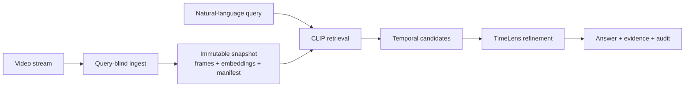

# StreamRecall

**Ask the past without replaying it.**

StreamRecall is an auditable visual-memory agent for post-hoc event retrieval
in streaming video. It watches a stream once, compresses the observed past into
an immutable byte-bounded snapshot, and later answers natural-language
questions using only that snapshot—not the source video or future frames.

The repository includes a runnable product demo and the StreamTimeLens research
engine behind its snapshot, retrieval, temporal-grounding, and audit contracts.

## Why it is different

Most video assistants can reread the complete video after seeing a question.
StreamRecall operates under a stricter protocol:

- video is ingested once and in temporal order;
- future questions are unknown during ingestion;
- query workers receive an immutable snapshot, never the source-video path;
- all query-visible state is charged by its serialized byte size;
- answers include a time span, evidence frames, confidence, and audit metadata;
- insufficient evidence produces an explicit `NOT_FOUND` instead of a guess.

## Architecture



The default demo backend is deterministic and model-free, so the complete
product contract can be explored without a GPU. The optional Hybrid V3 backend
connects the same API to real CLIP retrieval and TimeLens inference.

## What is included

- **Product:** Next.js workspace, FastAPI API, SQLite persistence, asynchronous
  query workers, resumable SSE events, MP4 ingestion, and evidence endpoints.
- **Memory protocol:** immutable snapshot manifests, content hashes, byte-budget
  enforcement, query/source isolation, and no-future-frame checks.
- **Grounding engine:** sparse visual memory, CLIP candidate retrieval, temporal
  clustering, bounded evidence allocation, refinement, and safe fallback.
- **Evaluation:** frozen configurations, official VTG metrics, paired bootstrap,
  resource accounting, protocol audits, and reproducible result provenance.

## Quick start

Requirements: Python 3.8+, Node.js 20.9+, and npm.

```bash
git clone https://github.com/Viiitoo/streamrecall.git
cd streamrecall
make setup
make demo
```

Open <http://127.0.0.1:3000>. API documentation is available at
<http://127.0.0.1:8000/docs>.

The bundled demo needs no model checkpoint or GPU. It demonstrates bounded
memory, structured `FOUND`/`NOT_FOUND` answers, evidence authorization, live
Agent events, and audit output. Its simulated latency and predictions are not
benchmark results.

## Real model backend

Set the backend and point it at audited StreamTimeLens snapshots before starting
the application:

```bash
git submodule update --init third_party/TimeLens
export STREAMRECALL_BACKEND=hybrid-v3
export STREAMRECALL_SNAPSHOT_ROOT=/absolute/path/to/snapshots
export STREAMRECALL_CLIP_DEVICE=cuda:0
export STREAMRECALL_DEVICE_MAP=cuda:0
make demo
```

The models are loaded lazily on the first query. Snapshot registration accepts
only paths relative to `STREAMRECALL_SNAPSHOT_ROOT`, verifies the manifest and
byte budget, and never returns the internal path through the API. See
[`apps/README.md`](apps/README.md) for registration, upload, and containerized
inference examples.

## Tests

```bash
git submodule update --init third_party/TimeLens
make test
```

This runs the FastAPI contract tests, the StreamTimeLens regression suite, and
a production Next.js build. Browser tests live in `apps/web/tests` and can be
run with `npm run test:e2e` after installing a Playwright browser.

## Repository layout

```text
apps/                 Web product and API
streamtimelens/       Snapshot, retrieval, grounding, and evaluation engine
src/baas/             Shared benchmark and provenance utilities
configs/              Baseline experiment configurations
scripts/              Reproduction and audit entry points
artifacts/             Small manifests and development metadata
third_party/TimeLens/  Optional upstream inference dependency (submodule)
```

Generated results, model checkpoints, datasets, runtime databases, and uploaded
videos are intentionally excluded from Git.

## Current scope

StreamRecall is a research prototype, not a production monitoring or safety
system. The strict protocol and engineering checks are implemented, but the
cross-dataset formal benchmark is still in progress. Development metrics must
not be presented as test-set or state-of-the-art results.

## License and third-party terms

Code authored for this project is released under the [MIT License](LICENSE).

The optional `third_party/TimeLens` submodule, its model weights, and related
assets are governed by the upstream TimeLens license, which includes academic-
use and geographic restrictions. Those terms are **not** replaced by this
repository's MIT license. Dataset and model users are responsible for following
their respective upstream licenses.

## Acknowledgements

StreamRecall builds on ideas and components from
[TimeLens](https://github.com/TencentARC/TimeLens),
[CLIP](https://github.com/openai/CLIP), and temporal video grounding research
including SnAG. Third-party implementations remain attributed to their original
authors and are not represented as official StreamRecall results.
