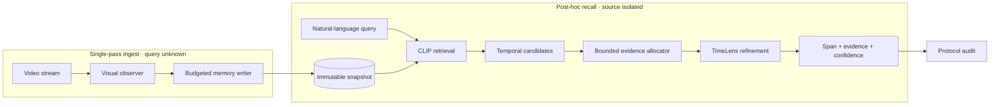

<div align="center">

# StreamRecall

### Ask the past without replaying it.

An auditable, memory-bounded agent for post-hoc event retrieval in streaming video.

[](https://github.com/Viiitoo/StreamRecall/actions/workflows/ci.yml)
[](LICENSE)
[](streamtimelens/pyproject.toml)
[](apps/web/package.json)
[](#-protocol)

[**Demo**](#-product-demo) · [**Method**](#-method) · [**Quick Start**](#-quick-start) · [**Evaluation**](#-evaluation) · [**Citation**](#-citation)

</div>


<p align="center">
  <em>Watch once · remember under a hard budget · answer later with grounded evidence</em>
</p>

## TL;DR

Most video assistants see the question first—or replay the full video afterward.
StreamRecall studies a stricter setting: the system watches a stream once, before
future questions are known, and compresses its past into an immutable visual
snapshot. When a query arrives, the agent can inspect only that bounded snapshot.
It returns a temporal span, cited evidence frames, confidence, and a protocol audit.

> **The central question:** what should a video agent remember when it does not
> yet know what it will be asked?

## ✨ Highlights

<table>
<tr>
<td width="25%" align="center"><b>Query-blind ingest</b><br/><sub>The writer never sees future questions or ground truth.</sub></td>
<td width="25%" align="center"><b>Hard memory budget</b><br/><sub>Every query-visible byte is serialized, counted, and audited.</sub></td>
<td width="25%" align="center"><b>Snapshot-only recall</b><br/><sub>The query worker cannot reopen the video or access future frames.</sub></td>
<td width="25%" align="center"><b>Grounded answers</b><br/><sub>Every answer carries a span, evidence, confidence, and failure mode.</sub></td>
</tr>
</table>

## 🧠 Method



StreamRecall separates ingestion from recall by construction. The writer stores
sparse visual evidence and metadata under a real byte budget. At query time,
CLIP retrieves diverse temporal candidates, a bounded allocator selects no more
than the allowed evidence frames, and TimeLens optionally refines the selected
interval. Invalid model output or insufficient evidence falls back safely—or
returns an explicit `NOT_FOUND`.

## 🔒 Protocol

| Capability | Conventional video QA | StreamRecall strict mode |
|---|:---:|:---:|
| Question known during encoding | Often | **No** |
| Replay source video at query time | Often | **Forbidden** |
| Access future frames | Possible | **Forbidden** |
| Memory limit | Token/config estimate | **Serialized bytes** |
| Evidence authorization | Optional | **Answer-bound references** |
| Failure behavior | Free-form answer | **Explicit abstention** |
| Reproducibility | Run-dependent | **Hash + config + provenance** |

The API never returns internal snapshot paths. Evidence endpoints serve only
frame references cited by the persisted answer, while snapshot readers reject
path traversal, hash mismatches, undeclared files, and budget violations.

## 🎬 Product demo

The repository ships a complete vertical slice—not only an evaluation script:

- a **Next.js visual-memory workspace** with replay, memory timeline, candidates,
  evidence cards, and developer trace;
- a **FastAPI service** with typed session, conversation, recall, upload, and
  evidence APIs;
- **asynchronous query workers** and resumable Server-Sent Events;
- **SQLite persistence** for sessions, turns, events, and recoverable failures;
- strict MP4 ingestion that can delete the app-owned source after a valid final
  snapshot is produced;
- a deterministic, model-free backend that demonstrates the complete contract
  without a GPU.

The bundled demo is deliberately labeled as simulated. Its predictions and
latency are interface examples, not benchmark claims.

## 🚀 Quick start

Requirements: Python 3.8+, Node.js 20.9+, and npm.

```bash
git clone https://github.com/Viiitoo/StreamRecall.git
cd StreamRecall
make setup
make demo
```

Open [http://127.0.0.1:3000](http://127.0.0.1:3000). Interactive API
documentation is available at [http://127.0.0.1:8000/docs](http://127.0.0.1:8000/docs).

<details>
<summary><b>Run the real CLIP + TimeLens backend</b></summary>

Initialize the separately licensed TimeLens dependency, then point StreamRecall
at a directory of audited snapshots:

```bash
git submodule update --init third_party/TimeLens
export STREAMRECALL_BACKEND=hybrid-v3
export STREAMRECALL_SNAPSHOT_ROOT=/absolute/path/to/snapshots
export STREAMRECALL_CLIP_DEVICE=cuda:0
export STREAMRECALL_DEVICE_MAP=cuda:0
make demo
```

Models load lazily on the first query. Snapshot registration accepts only paths
relative to `STREAMRECALL_SNAPSHOT_ROOT` and validates the manifest, allow-list,
content hash, and byte budget before creating a session. See
[`apps/README.md`](apps/README.md) for upload, registration, and container examples.

</details>

## 📊 Evaluation

StreamRecall includes a reproducible evaluation stack for delayed-query
streaming video temporal grounding:

- frozen method, model, budget, and protocol configurations;
- official temporal IoU / recall metrics and group-wise diagnostics;
- paired video bootstrap and resource accounting;
- immutable result directories keyed by Git commit;
- resolved config snapshots, hashes, commands, environment, and provenance;
- deterministic golden regressions and protocol audits.

| Engineering gate | Status |
|---|:---:|
| Python API + core regression suite | ✅ |
| Next.js production build | ✅ |
| Ruff static checks | ✅ |
| Snapshot integrity and actual-byte budget | ✅ |
| No-future-frame and snapshot-only audit | ✅ |
| Formal cross-dataset benchmark | 🚧 In progress |

We intentionally do **not** report development results as test-set performance
or claim state of the art before the formal cross-dataset benchmark is complete.

### Run verification

```bash
git submodule update --init third_party/TimeLens
make test
```

The browser suite lives in `apps/web/tests` and can be run with
`npm run test:e2e` after installing a Playwright browser.

## 🗂️ Repository map

```text
StreamRecall/
├── apps/
│   ├── api/                 FastAPI, workers, persistence, evidence API
│   └── web/                 Next.js visual-memory workspace
├── streamtimelens/          Memory, retrieval, grounding, evaluation engine
├── src/baas/                Shared benchmark and provenance utilities
├── configs/                 Reproducible baseline configurations
├── scripts/                 Experiment, audit, and reproduction entry points
├── artifacts/               Small public manifests only
└── third_party/TimeLens/     Optional upstream dependency (Git submodule)
```

Model checkpoints, datasets, uploads, runtime databases, logs, and generated
results are intentionally excluded from Git.

## 🧭 Scope and roadmap

StreamRecall is a research prototype—not a production surveillance, incident
response, or safety-decision system.

- [x] Immutable, byte-bounded visual snapshots
- [x] Snapshot-only query API with evidence authorization
- [x] CLIP retrieval + optional TimeLens local refinement
- [x] Interactive product demo and strict upload path
- [x] Reproducible evaluation and protocol audit stack
- [ ] Complete formal evaluation across all frozen datasets
- [ ] Publish a small redistributable end-to-end video example
- [ ] Package a hardware-portable real-model deployment profile

## 📜 License

Code authored for this project is released under the [MIT License](LICENSE).

The optional `third_party/TimeLens` submodule, model weights, and related assets
are governed by the upstream TimeLens license, which includes academic-use and
geographic restrictions. Those terms are **not** replaced by this repository's
MIT license. Datasets and models remain subject to their own upstream terms.

## 📝 Citation

If StreamRecall is useful in your research or engineering work, please cite the
repository:

```bibtex
@software{streamrecall2026,
  title  = {StreamRecall: Auditable Memory-Bounded Recall for Streaming Video},
  author = {Viiitoo},
  year   = {2026},
  url    = {https://github.com/Viiitoo/StreamRecall}
}
```

## 🙏 Acknowledgements

StreamRecall builds on ideas and components from
[TimeLens](https://github.com/TencentARC/TimeLens),
[CLIP](https://github.com/openai/CLIP), and temporal video grounding research
including SnAG. Third-party implementations remain attributed to their original
authors and are not represented as official StreamRecall results.

---

<div align="center">
<sub>Built for a harder question than “what is in this video?”—what can an agent still prove after the video is gone?</sub>
</div>
